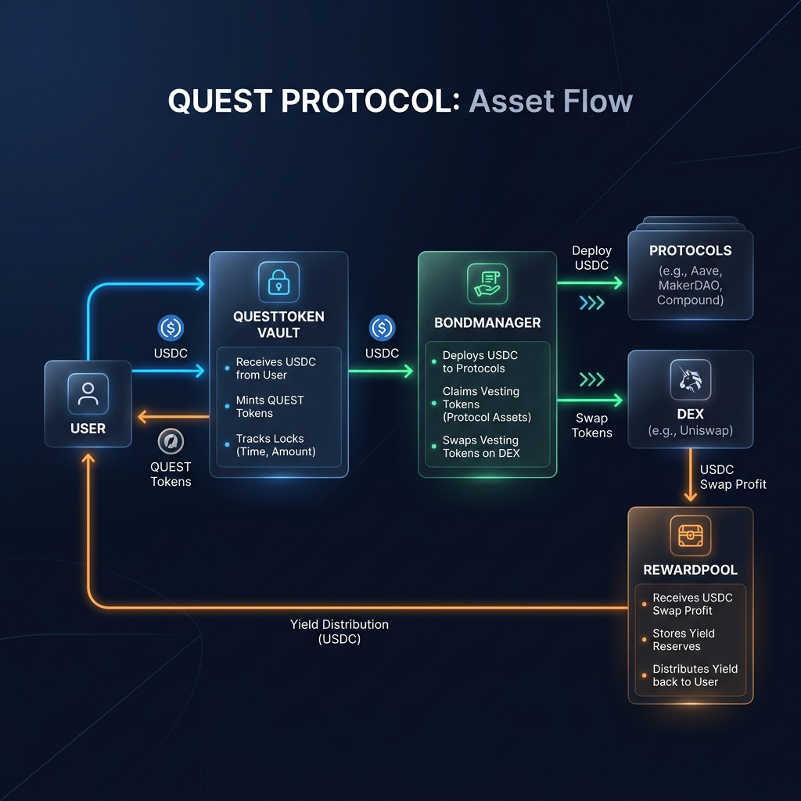
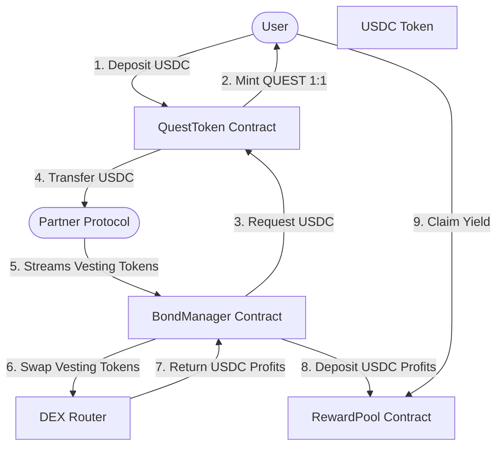

# Quest Protocol V1

Quest Protocol is a decentralized **Liquidity-as-a-Service (LaaS)** protocol designed to match idle capital with yield-generating DeFi opportunities. By providing structured, tiered vaults and tokenized bond partnerships, Quest solves the dual problem of liquidity fragmentation for protocols and yield generation for depositors.



---

## 1. What is Quest?

Quest connects yield-seeking depositors with capital-hungry DeFi protocols using a structured, discounted-bond model.

### The Business Flow:
1. **Capital Inflow**: Users deposit USDC into the `QuestToken` vault, choosing one of three locked duration tiers: **30 days**, **60 days**, or **90 days**. In return, they receive `QUEST` utility tokens 1:1, representing their share of the vault's principal.
2. **Capital Deployment**: Vetted partner protocols request capital by offering "bonds" via `BondManager`. These bonds are denominated in the protocol's own native utility tokens, sold at a **15% to 30% discount** relative to the current market price in exchange for immediate USDC liquidity.
3. **Vesting & Swaps**: The protocol's discounted tokens vest linearly over a set period. `BondManager` claims these vested tokens periodically and sells them on-chain using an authorized decentralized exchange (DEX) router (e.g. Uniswap V2 or PancakeSwap).
4. **Profit Generation**: Because the tokens were acquired at a discount, swapping them back to USDC generates a profit:
   $$\text{Profit} = \text{USDC}_{\text{received from swap}} - \text{USDC}_{\text{cost basis}}$$
5. **Reward Mutualization**: The realized USDC profit is deposited into the `RewardPool` and distributed proportionally to all `QUEST` holders. Yield shares are scaled by deposit size and a lockup tier multiplier (30 days = **1.0x**, 60 days = **1.5x**, 90 days = **2.0x**) to reward longer-term capital commitments.

---

## 2. Smart Contract Architecture

The core protocol is built using three tightly coupled smart contracts:



### 1. [QuestToken](file:///home/adeyemi/Documents/Work/quest/src/Token/QuestToken.sol) (Vault)
* **Role**: The ERC20 vault token and single source of truth for capital availability and accounting.
* **Key Functions**: Manages deposits and withdrawals, enforces hard lockup durations, maintains tier-specific deposit aggregates (`totalLockedByTier`, `totalDeployedByTier`), and calculates the user's weighted balance (`getWeightedBalance`) based on their tier multipliers.
* **Storage**: Tracks individual deposits per user via the `DepositReceipt` struct.

### 2. [BondManager](file:///home/adeyemi/Documents/Work/quest/src/Token/BondManager.sol)
* **Role**: Orchestrates the partnership lifecycle, token vesting, and profit realization.
* **Key Functions**: Registers partner protocols, creates discounted bonds, claims vested tokens, swaps them to USDC, distributes profits to the `RewardPool`, and triggers emergency exits.
* **Integration**: Integrates with external Uniswap-compatible routers via the chain-agnostic `IDexRouter` interface.

### 3. [RewardPool](file:///home/adeyemi/Documents/Work/quest/src/Pool/RewardPool.sol)
* **Role**: Fairly distributes realized USDC yield back to depositors.
* **Key Functions**: Implements an index-based reward distribution pattern. Tracks user-specific reward debt baselines to prevent retroactive yield gaming.

---

## 3. Key Design Decisions

### Duration Matching
Bonds can only draw capital from vault tiers with a lockup duration equal to or longer than the bond's vesting period. 
* **Why**: This prevents bank runs and liquidity mismatches. For example, a protocol borrowing capital for a 90-day vesting window cannot draw from 30-day locked capital, ensuring the vault always remains solvent for users withdrawing their matured funds.

### Per-Deposit `DepositReceipt` Structs with FIFO Withdrawal
Unlike traditional yield farms that aggregate user deposits into a single numeric balance, Quest tracks every deposit individually:
```solidity
struct DepositReceipt {
    uint256 amount;
    LockupPeriod tier;
    uint256 lockupEnd;
    bool expiryCounted;
    uint256 rewardDebt;
}
```
* **Why**: This allows a single user to maintain multiple active lockups with different durations and start times. Withdrawals are processed on a first-in-first-out (FIFO) basis among expired deposits to guarantee fair liquidity release.

### Lazy Expiry Evaluation
Instead of using automated network keepers or cron jobs to update locked and deployed aggregates when deposits expire, Quest evaluates expiry opportunistically during user interactions (`deposit` and `withdraw` calls).
* **Why**: This eliminates reliance on centralized off-chain keepers, saves significant gas for the protocol, and reduces the protocol's attack surface by removing oracle or keeper dependencies.

### Reward Index Pattern with Per-Receipt `rewardDebt`
Quest utilizes a global accumulating index pattern (`rewardIndex`) to track reward distribution. When profits are sent to the `RewardPool`, `rewardIndex` increases proportionally to the total weighted supply. Each `DepositReceipt` records its own `rewardDebt` at the time of deposit:
$$\text{rewardDebt} = \frac{\text{rewardIndex} \times \text{weight}}{10^{18}}$$
* **Why**: Traditional yield farms track debt per user, which is susceptible to manipulation if a user deposits right before rewards are distributed. By snapshotting debt *per receipt* during deposit, late depositors are mathematically blocked from claiming yield generated before they entered the pool.

### Mutualized Reward Pool
Rewards are socialized across the entire vault. Yield generated by a specific bond is distributed to all depositors based on their share of the global `totalWeightedSupply`, rather than only rewarding the depositors of the specific tier from which the bond drew capital.
* **Why**: This socializes risk. If one protocol defaults or its token collapses, the loss is mutualized, and depositors are still supported by yields from other active bonds. It also rewards 90-day depositors with higher yields (2.0x multiplier) for committing long-term capital stability, regardless of whether their specific capital was deployed.

### Chain-Agnostic DEX Interface (`IDexRouter`)
`BondManager` interacts with exchanges using a generic interface matching the Uniswap V2 router specification:
```solidity
interface IDexRouter {
    function swapExactTokensForTokens(
        uint256 amountIn,
        uint256 amountOutMin,
        address[] calldata path,
        address to,
        uint256 deadline
    ) external returns (uint256[] memory amounts);
}
```
* **Why**: This allows Quest to be deployed on any EVM chain. The protocol can run on BNB Chain (swapping via PancakeSwap), Polygon (swapping via QuickSwap), or Base (swapping via Uniswap V2) without code changes.

### No Oracles
Price discovery and profit calculations are determined at the time of swap via the DEX router. The protocol does not rely on Chainlink or raw oracle feeds.
* **Why**: Oracle dependency is one of the most common vectors for flash loan manipulation and exploit vectors in DeFi. Instead, Quest mitigates slippage risk by passing a user-defined `minUsdcOut` parameters during swap transactions, moving the price validation responsibility to administrative trade execution.

### Enforced Reserve Ratio
When creating a bond, `BondManager` calls the vault to check available tier capital. A bond can only be created if:
$$\text{totalLockedByTier}[\text{tier}] - \text{totalDeployedByTier}[\text{tier}] \ge \text{amount}$$
* **Why**: Enforces that the vault never overallocates user funds, ensuring there is always sufficient USDC reserves left to satisfy matured user withdrawals.

---

## 4. Bond Lifecycle

```
[Register Protocol] 
       │
       ▼
  [createBond] ────► (Validates matches, TVL caps, transfers USDC, locks tier capital)
       │
       ▼
  [claimBond]  ────► (Calculates linear vested tokens, pulls from protocol to BondManager)
       │
       ▼
 [sellBondTokens] ──► (Swaps tokens on DEX, calculates cost basis, routes profits to RewardPool)
       │
       ▼
 [Bond Completed] ──► (Updates totalDeployedByTier, marks bond inactive)
```

1. **Protocol Registration**: The owner calls `registerProtocol` on the `BondManager` to whitelist the partner protocol and define its capacity limits.
2. **Bond Creation (`createBond`)**:
   - Checks that the protocol is registered and active.
   - Validates that the requested vesting days match the capital tier constraints.
   - Assures the TVL limit of the protocol is not exceeded.
   - Follows the Checks-Effects-Interactions (CEI) pattern: updates internal accounting, lends USDC from the vault to the protocol via `vault.lendUSDC()`, and marks the capital as deployed via `vault.markDeployed()`.
3. **Bond Claiming (`claimBond`)**:
   - Computes linearly vested tokens:
     $$\text{vested} = \frac{\text{totalTokens} \times \text{elapsedTime}}{\text{vestingDuration}}$$
   - Transfers the unclaimed vested portion from the protocol's contract into the `BondManager`.
4. **Token Sale (`sellBondTokens`)**:
   - Swaps claimed tokens to USDC on-chain via the DEX router.
   - Calculates the cost basis of the sold tokens:
     $$\text{Cost Basis} = \frac{\text{USDC Provided} \times \text{Tokens Sold}}{\text{Total Bond Token Amount}}$$
   - Splits the swapped USDC: principal (cost basis) is returned to the `QuestToken` vault, and the profit is deposited into the `RewardPool` via `depositRewards()`.
   - If the bond is fully claimed and sold, it is marked inactive, and capital is released back to the vault via `vault.markReturned()`.
5. **Emergency Exit (`emergencyExitBond`)**:
   - A circuit breaker for underperforming or distressed partner protocols.
   - Immediately recovers all vested but unclaimed tokens, updates vault deployment accounting to release the principal lock, and leaves the remaining token disposal to manual owner administration.

---

## 5. Reward Distribution Math

The RewardPool calculates claims using an accumulating global index model:

### 1. Index Accumulation
When profit arrives in the pool:
$$\Delta\text{rewardIndex} = \frac{\text{Profit Amount} \times 10^{18}}{\text{totalWeightedSupply}}$$
$$\text{rewardIndex}_{\text{new}} = \text{rewardIndex}_{\text{old}} + \Delta\text{rewardIndex}$$

### 2. User Claimable Formula
For any active deposit receipt:
$$\text{Claimable} = \frac{\text{rewardIndex} \times \text{Receipt Weight}}{10^{18}} - \text{rewardDebt}$$
Where:
$$\text{Receipt Weight} = \frac{\text{Deposit Amount} \times \text{Tier Multiplier}}{10^{18}}$$

### Concrete Example:
* Alice deposits **1,000 USDC** into the **90-day tier** (2.0x multiplier).
  $$\text{Alice Weight} = \frac{1,000 \times 2.0 \times 10^{18}}{10^{18}} = 2,000\text{ (weighted units)}$$
* Total weighted supply of the vault is **10,000 units**.
* A bond matures and deposits **500 USDC** in profit.
  $$\Delta\text{rewardIndex} = \frac{500 \times 10^{18}}{10,000} = 0.05 \times 10^{18}$$
* Alice's claimable rewards:
  $$\text{Claimable} = \frac{(0.05 \times 10^{18}) \times 2,000}{10^{18}} - 0 = 100\text{ USDC}$$
* If Alice claims, her `rewardDebt` for this receipt is updated to $100 \times 10^{18}$, resetting her claimable balance to zero until new profits are deposited.

---

## 6. Security Properties

Quest V1 is designed to be correct-by-definition under adversarial conditions:
* **Reentrancy Protection**: Applied OpenZeppelin's `ReentrancyGuard` on all state-mutating functions.
* **Checks-Effects-Interactions (CEI)**: Enforced strictly. Internal state variables (such as updating active deposits and marking capital deployed) are written to storage *before* making external contract calls.
* **SafeERC20**: Enforced for all token transfers to safely interact with non-standard ERC20 tokens (e.g., USDT/USDC variations).
* **Custom Errors**: Replaced string-based reverts with custom solidity errors (e.g., `ZeroAddress()`, `MinDepositNotMet()`) to maximize gas efficiency and streamline error parsing.
* **Access Control**: Hard administrative boundaries. Only the owner can manage whitelist registrations, while cross-contract interaction utilizes `vaultManager.isManager` checks.
* **No Oracle Surface**: Eliminating raw price oracles shields Quest from price manipulation, sandwich attacks, and flash-loan exploits.
* **Hard Lockups**: Lockup periods are cryptographically and temporally absolute in V1. There are no emergency exit paths for users to retrieve locked capital before lockup expiry.

---

## 7. Known Limitations (V1)

* **Manual Bond Management**: Trading tokens, claiming vested balances, and calling swaps are administrative actions requiring manual transaction triggers. Automated keepers are deferred to V2.
* **No Slash Mechanics**: If a partner protocol defaults, capital recovery relies on the `emergencyExitBond` token reclamation. Native on-chain slashing mechanics are not present in V1.
* **No Streaming Revenue Model**: Yield distribution is episodic—occurring only when `sellBondTokens` is executed—rather than streaming continuously over time.

---

## 8. Deployment

The contracts are deployed behind upgradeable `ERC1967Proxy` setups.

### Example Local Test Addresses (Anvil / Chain 31337):
* **QuestToken Vault (Proxy)**: `0xDB8cFf278adCCF9E9b5da745B44E754fC4EE3C76`
* **RewardPool (Proxy)**: `0x62c20Aa1e0272312BC100b4e23B4DC1Ed96dD7D1`
* **BondManager (Proxy)**: `0xDEb1E9a6Be7Baf84208BB6E10aC9F9bbE1D70809`
* **Mock USDC (Asset)**: `0x7FA9385bE102ac3EAc297483Dd6233D62b3e1496`
* **Mock DEX Router**: `0x34A1D3fff3958843C43aD80F30b94c510645C316`

### How to Deploy:
1. Configure environment variables in a `.env` file:
   ```env
   PRIVATE_KEY=your_deployer_private_key
   USDC_ADDRESS=target_usdc_contract_address
   DEX_ROUTER_ADDRESS=target_uniswap_v2_router_address
   OWNER_ADDRESS=designated_multisig_or_governance_owner
   ```
2. Execute the deployment script:
   ```bash
   forge script script/Deploy.s.sol:DeployScript --rpc-url <rpc_url> --broadcast --verify
   ```

---

## 9. Testing

Quest Protocol implements a strict, comprehensive verification suite:
* **Stateless Unit Tests**: Validate basic state variables, setups, and boundaries.
* **Stateless Fuzzing**: Validates linear vesting curves and division tolerances over arbitrary inputs.
* **Stateful Invariant Fuzzing**: A handler-based invariant campaign executing random combinations of deposits, withdrawals, reward updates, and time-warps over hundreds of runs.

To run the full test suite:
```bash
forge test
```

To run coverage:
```bash
forge coverage --ir-minimum
```

---

## 10. What's Next (Izumi)

Quest Protocol V1 serves as the decentralized, yield-generating DeFi engine. The next step is building **Izumi**—a product layer that connects Quest's smart contracts to fiat payment rails. By leveraging **Nomba's Dedicated Virtual Accounts (DVA)** and **Global Payout APIs**, Izumi will allow Nigerian SMEs and freelancers to deposit local currency (Naira), auto-convert it to USDC yield-bearing vault positions on-chain, and off-ramp earnings directly back to local bank accounts, bridging the gap between local cash flows and global DeFi yields.
